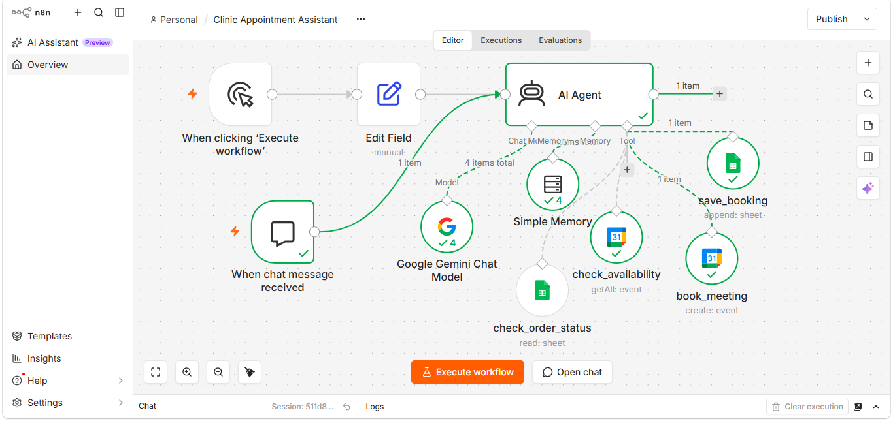

# flowmatic-ai-automation-portfolio
AI Automation projects built for real business use-cases
# Flowmatic — AI Automation Portfolio

Real, tested AI automation projects built for actual business use-cases. 
Each project below solves a genuine business problem using AI + no-code automation tools.

📄 Full case studies with business impact: [View on Notion](https://app.notion.com/p/Flowmatic-AI-Automation-Portfolio-3db68afcc5888009aee4d5b5cc4181aa?t=3db68afcc588807b95b300a95a2b0234)

---

## Project 1: AI Clinic Appointment Assistant

**Problem:** Clinics lose time and bookings to manual phone-call scheduling. Staff have to check the calendar, call the patient back, and log the appointment manually — slow and error-prone.

**Solution:** A conversational AI agent that understands a patient's request, checks real-time doctor availability, confirms the time, books the appointment, and logs the record automatically — no human needed.

**Tech Stack:** n8n, Google Gemini AI, Google Calendar API, Google Sheets

**How it Works:**
1. Patient sends a message → AI understands the request
2. Assistant checks doctor availability on Google Calendar
3. Confirms the time and patient details
4. Books the appointment automatically
5. Logs the booking (name, phone, time, status) to Google Sheets

**Result:** Fully automated, tested end-to-end appointment booking system — verified working in both Google Calendar and Google Sheets.

### Project 2: UrbanCart PK Support Bot (RAG)

A customer support bot for an online clothing store that answers shipping, payment, return and order questions in Roman Urdu, Urdu and English, using only the store's own knowledge base.

**How it works**
- **Ingestion workflow (run once):** 14 FAQ chunks are embedded in a single batch call and the vectors are stored in Google Sheets.
- **Chat workflow (every message):** the customer's question is embedded, ranked against the stored vectors with cosine similarity (JavaScript), and the top 3 chunks are passed to a Gemini agent as context.

**Key decisions**
- Embed documents once, not on every message, to save API quota and keep replies fast.
- Vectors reduced to 768 dimensions so they fit inside a Google Sheets cell.
- A grounded system prompt with separate handling for greetings, questions missing from the knowledge base (fallback with support contact) and off-topic questions.

**Testing**
- 15-question test set covering Roman Urdu, indirect questions, two questions in one message, missing-from-KB and off-topic cases: 15/15 passed on the baseline run.
- Re-tested key cases after prompt changes to check for regressions.

**Limitations and next step**
Google Sheets works for a small knowledge base. For larger ones the plan is to move storage to a vector database (Pinecone).

**Tech stack:** n8n, Google Gemini (embeddings and chat), Google Sheets, JavaScript

---
## Project 3: AI-Powered WhatsApp Lead Bot

**Problem:** Businesses lose leads because they can't reply to WhatsApp messages instantly, 24/7. Manual replies are slow and inconsistent.

**Solution:** An automated pipeline that receives a customer's WhatsApp message, generates a smart AI-powered reply based on the business's tone/instructions, logs the lead, and sends the reply back — all within seconds, no human needed.

**Tech Stack:** Make.com, Meta WhatsApp Business Cloud API, Google Gemini AI, Google Sheets

**How it Works:**
1. Customer sends a WhatsApp message → Webhook receives it
2. Google Gemini AI reads the message and generates a professional, on-brand reply
3. Lead details (name, number, message, timestamp) are logged into Google Sheets
4. AI-generated reply is sent back to the customer via WhatsApp API

**Result:** Fully automated, tested end-to-end lead response system — reduces response time from hours to seconds, works even outside business hours.

---
## Project 4: AI Customer Support Ticket Classifier

**Problem:** Support teams waste time manually reading every customer ticket to figure out what it's about and how urgent it is — this delays response to critical issues.

**Solution:** An automated system that receives a customer support message, uses AI to instantly classify it by category and priority level, and logs it in an organized format — so teams can act on urgent tickets first.

**Tech Stack:** n8n, Google Gemini AI, Google Sheets

**How it Works:**
1. Customer support message comes in via Webhook
2. Google Gemini AI analyzes the message and classifies it (category + priority)
3. A Code node parses the AI's response into clean structured data
4. Ticket details (customer name, email, message, category, priority) are saved to Google Sheets

**Result:** Instant, consistent ticket triage — no more manual sorting, urgent issues get flagged automatically.
